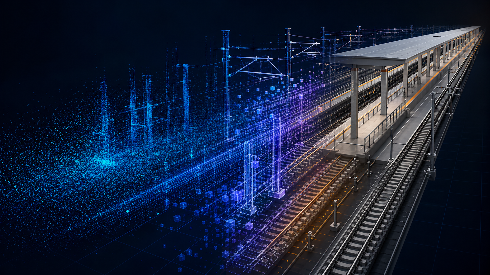
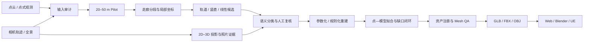

<p align="center">
  
</p>

# Railway Scene Reconstruction Kit

> 从铁路点式几何观测与全景影像，生成证据可追踪、资产可查询、可交付至 Web / Blender / UE 的结构化 CIM 场景。  
> *An evidence-aware pipeline for traceable railway scene reconstruction.*


本仓库把已验证的铁路场景重建做法整理成配置、命令行、数据合同、资产注册表和质量门禁，供后续项目按“换数据、换配置、保留方法”的方式复用。

> [!IMPORTANT]
> 仓库只包含通用代码、合成示例、示意封面和脱敏文档；不包含客户点云、现场全景、精确坐标、设备台账、生产模型或历史中间版本。默认使用 GitHub 私有仓库。

## 为什么需要这套方法

铁路走廊通常只有沿线、单侧或不连续观测。细线缺点、遮挡和建筑背面缺失意味着“直接把点云或高斯转成 Mesh”不能稳定得到可编辑的工程模型。

本工具包采用三条互补路线：

- **点式观测负责几何真值**：位置、高程、截面、边界和内部拟合；
- **全景影像负责可见语义**：构件类别、门窗、标牌、外观和遮挡复核；
- **铁路规则负责显式补全**：只补可解释结构，并始终保留证据等级。

最终交付的不只是 Mesh，而是“模型 + 资产 ID + 证据 + 置信度 + QA 结果”。

## Pipeline



| 阶段 | 主要输出 |
|---|---|
| 输入审计 | 点云字段、轨迹覆盖、照片清单、坐标与精度声明 |
| Pilot | 20–50 m 小样段、局部坐标框架、阈值基线 |
| 候选与证据 | 钢轨、杆柱、线缆候选及照片投影依据 |
| 结构化重建 | 参数化轨道、复核场景和稳定资产 ID |
| 质量闭环 | 点—模型残差、缺口、拓扑和 Mesh 检查 |
| 工程交付 | 资产注册表、GLB/FBX/OBJ、Web 查看器 |

## 四级证据体系

| 等级 | 含义 | 处理方式 |
|---|---|---|
| `observed` | 点式几何直接支持关键形体 | 进入内部拟合统计 |
| `photo_interpreted` | 已配准照片确认可见形体 | 记录照片和可见范围 |
| `rule_inferred` | 由铁路规则或连续性补全 | 低置信、可单独关闭 |
| `unsupported` | 当前证据无法确认 | 不冒充实测资产 |

## 已提供的可执行能力

- 项目初始化、JSON Schema 校验和安全工作区；
- LAS/LAZ、相机 CSV、全景目录输入审计；
- 相机轨迹分段、局部坐标建立和 LAZ 裁切；
- 钢轨、竖直杆件和线性构件 Pilot 候选；
- 参数化轨道 OBJ 与证据复核场景生成；
- 点云—全景姿态假设搜索与投影叠加；
- 资产注册表、人工复核导入、运行清单和基础 QA；
- OBJ 退化面/重复面检查及 Blender 清理导出脚本；
- 配置驱动的 Three.js GLB 查看与资产查询页面；
- GitHub Actions、合成端到端测试和发布前敏感信息扫描。

## 脱敏案例：约 200 m 站场重点区

该案例验证了从小样段到完整重点区的生产方法，涉及多股道、站台、雨棚、接触网、楼梯、电梯、可见立面、低置信背面、资产查询和 Mesh 清理。

最值得复用的不是旧项目尺寸，而是以下机制：

1. 先冻结 Pilot，再扩展重点区和整条走廊；
2. clean 主模型与 candidate/evidence 图层分开；
3. 轨道断裂和重叠必须在资产拓扑层修复；
4. 站台与雨棚按真实分段重建，不用大平面掩盖缺口；
5. 柱—梁—屋面、楼梯出口和站台边缘必须近景复核；
6. 不可见区域始终保留低置信度和来源说明。

[查看完整脱敏案例](docs/CASE_STUDY_200M_CN.md)

## 10 分钟开始

```powershell
.\scripts\bootstrap.ps1
.\.venv\Scripts\Activate.ps1
python scripts\run_tests.py

railway-recon init projects/demo --name "Demo Railway"
railway-recon validate --project projects/demo/project.json
railway-recon audit --project projects/demo/project.json
railway-recon plan-segments --project projects/demo/project.json
```

真实数据放入 `projects/demo/input/`；该目录默认不进入 Git。随后运行：

```powershell
railway-recon segment --project projects/demo/project.json
railway-recon registry-init --project projects/demo/project.json
railway-recon qa --project projects/demo/project.json
railway-recon safety-check --root .
```

## Web / Blender / UE

- **Web**：完整场景浏览、资产拾取、证据筛选和属性查询；
- **Blender**：六视角、背面剔除、法线、重叠面和接口复核；
- **UE**：单位、轴向、材质、细线、LOD/Nanite 和碰撞验收；
- **交换格式**：保持 GLB / FBX / OBJ 与资产注册表的一致身份。

## 演示视频怎么放

README 内最稳妥的方式是内嵌一个 6–10 秒、低体积的 GIF/动态图，点击后打开 GitHub Release 中的完整 MP4。完整视频不写入普通 Git 历史。

现有纯模型飞行视频可用于**已授权的私有仓库**。仓库若公开，必须先确认客户对衍生模型画面的公开授权；原始全景、点云空间布局、精确指标和带站名证据图不得作为宣传素材。

[查看 GitHub 宣传页与视频发布指南](docs/GITHUB_SHOWCASE_CN.md)

## 文档

- [中文技术手册](docs/TECHNICAL_MANUAL_CN.md)
- [新项目快速上手](docs/QUICKSTART_CN.md)
- [输入与输出数据合同](docs/DATA_CONTRACT_CN.md)
- [资产注册表与证据等级](docs/ASSET_REGISTRY_CN.md)
- [质量验收与交付](docs/QA_ACCEPTANCE_CN.md)
- [新项目检查清单](docs/NEW_PROJECT_CHECKLIST_CN.md)
- [复用工具包后续开发路线](docs/DEVELOPMENT_ROADMAP_CN.md)
- [GitHub 私有部署](docs/GITHUB_DEPLOYMENT_CN.md)

## 当前边界

当前 `v0.1.0` 是可复用生产基础工具包，不是一键生成完整车站的黑盒产品。构件级照片证据包、竖直构件自动语义、完整接触网、站台—雨棚—立面自动拟合和跨段资产化 GLB 仍在产品化路线中。

没有 CRS、垂直基准和独立控制点时，只能报告模型相对于当前点式观测的**内部拟合精度**，不能声明绝对测量精度。

## 协作与数据安全

请使用功能分支和 Pull Request。任何改变资产存在性、证据等级或精度声明的修改，都应由第二位复核人确认。首次部署保持 Private；推送前运行 `railway-recon safety-check --root .`。

详见 [CONTRIBUTING.md](CONTRIBUTING.md)、[SECURITY.md](SECURITY.md) 和 [LICENSE-NOTICE.md](LICENSE-NOTICE.md)。
