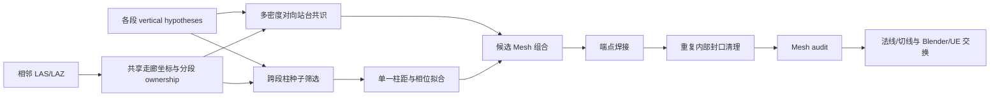

# 对向站台、跨段柱网与 Mesh 接缝通用 Pipeline

## 1. 这次回写解决什么问题

第二项目证明，单段算法能工作并不等于整条走廊可以稳定生产。相邻 50 米分段分别重建时，最容易出现四类问题：

1. 对向站台远侧边界受遮挡，单一密度阈值会让站台忽宽忽窄；
2. 雨棚柱在分段边界附近重复、漏建，且每段单独拟合会产生不同柱网相位；
3. 相邻 OBJ 的端点位置、高程不完全一致，组合后出现裂缝或错台；
4. 两个闭合体在接缝处各保留一张端盖，导入 Blender / UE 后发生 Z-fighting。

现在这些能力已从第二项目专用脚本回写为可配置模块，并由一个计划文件统一调度。原始点云、历史报告和冻结交付模型均按只读输入处理。

## 2. 总体流程



关键顺序是：**ownership 先于重建，焊接先于最终法线/切线生成**。不能先把各段独立模型直接叠加，也不能在焊接后继续使用旧法线。

## 3. 已回写的模块

| 能力 | 模块 | 主要输出 |
|---|---|---|
| 对向站台重建 | `opposite_platform_reconstruction.py` | OBJ、MTL、资产注册表、多密度报告、证据门禁、Mesh audit |
| 跨段柱网恢复 | `corridor_column_grid.py` | 统一相位柱网、种子决策、所属分段、待补证位置 |
| 分段焊接与内部封口 | `mesh_seam_reconciliation.py` | 焊接 OBJ、端盖删除记录、Mesh audit、可选更新注册表 |
| 统一调度 | `side_asset_pipeline.py` | 全部配置阶段的运行报告 |

对应 CLI：

```text
railway-recon reconstruct-opposite-platform
railway-recon recover-corridor-column-grid
railway-recon reconcile-mesh-seams
railway-recon run-side-asset-pipeline
```

配置模板位于：

- `configs/templates/opposite_platform_reconstruction.default.json`
- `configs/templates/corridor_column_grid.default.json`
- `configs/templates/mesh_seam_reconciliation.example.json`
- `configs/templates/side_asset_pipeline.example.json`

## 4. 对向站台重建策略

每段使用六组不同网格密度、最小点数和闭运算参数重复提取站台。只有同时满足以下条件才生成候选 Mesh：

- 至少三组密度配置给出有效结果；
- 轨道侧边界跨配置稳定；
- 站台高程跨配置稳定；
- 所有拟合段之间没有无法解释的纵向缺口；
- ownership 边界仅需要短距离外推；
- 保守站台宽度为正。

远离轨道、容易受遮挡的外侧边界不取最大范围，而取多组结果的公共交集。这样会少建一条证据不足的外侧窄带，但不会用大平面掩盖缺点。

相邻分段推荐传入 `--ownership-plan`。模块会把共享走廊 ownership 区间换算成当前分段的局部里程，避免人工把主坐标里程误填为局部里程。

默认允许最多 1.0 米的边界外推。该数值用于覆盖 5 米拟合窗在 ownership 切面处产生的量化偏差；超过阈值仍会失败，不会无证据贯穿缺口。

## 5. 柱网恢复策略

柱网不再按每个 50 米分段分别拟合，而是将所有竖直候选投影到同一个走廊坐标系后一次拟合柱距和相位。自动种子必须同时满足：

- 语义类别为 `canopy_column`；
- 位于指定左右侧；
- 位于该分段唯一 ownership 区间；
- 高度、横向距离和竖直占用率通过配置门禁。

输出中的位置分为两类：

- `seed_supported_position`：有点云柱候选支撑，可以进入后续局部几何复核；
- `grid_inferred_pending_local_point_support`：只由周期规律推断，不能直接冒充实测柱。

正式验收可以将 `require_reviewed_seed_ids` 设为 `true`，只允许已复核种子参与拟合。自动模式适合快速生产候选，不代表最终资产确认。

## 6. 接缝焊接和内部封口清理

接缝设置显式列出左右对象、共享里程、允许的横向/高程差和端盖策略。程序只修改列出的对象对：

1. 在接缝容差内提取端点簇；
2. 按横向位置和高程一一配对；
3. 将两侧端点移动到共享平均位置；
4. 仅当两侧端盖三角形坐标完全重合时，删除配置指定一侧的端盖；
5. 重新运行 OBJ Mesh audit。

内部封口不会按对象名盲删。只要端盖无法证明重复，程序就保留几何或直接失败。这样可避免把真正的外露端面删掉。

项目应根据自己的初始接缝差设置 `maximum_cross_delta_m` 和 `maximum_z_delta_m`。阈值是质量门禁，不是越大越好；如果差异过大，应返回站台/屋面拟合阶段，而不是强行焊接。

## 7. 一键计划文件

复制 `configs/templates/side_asset_pipeline.example.json` 到新项目并替换路径。计划可以包含多个站台段、一个或多个柱网和多个接缝组。

```powershell
railway-recon run-side-asset-pipeline `
  --project projects/new-line/project.json `
  --plan projects/new-line/configs/side_asset_pipeline.json `
  --output workspace/reports/side_asset_pipeline_run.json
```

该入口是显式编排器，不是黑箱。它不会猜测“哪一侧是对向站台”、不会自行放宽误差门禁，也不会自动把待补证柱变成最终构件。

## 8. 下一项目的推荐接入顺序

1. 完成输入审计和多点云唯一 ownership；
2. 生成相邻分段的 vertical hypotheses；
3. 建立共享 `segment_ownership_plan.json`；
4. 对每个存在对向站台的分段运行多密度重建；
5. 跨全部相邻分段恢复统一柱网；
6. 对推断柱补局部点云或照片证据；
7. 组合已通过门禁的候选对象；
8. 对显式对象对做接缝焊接和重复内部封口清理；
9. 运行 Mesh audit、对象注册表检查和六固定视角检查；
10. 最后生成显式法线/切线并导出 GLB / FBX / OBJ。

## 9. 第二项目非覆盖回归结果

回归输出放在第二项目新建的 `generic_pipeline_regression_v1` 目录，没有覆盖冻结 150 米交付版。

| 检查 | 结果 |
|---|---:|
| 对向站台 | 3/3 分段通过 |
| 多密度配置 | 每段 6 组被接受 |
| 站台关键边界 | 与此前项目专用实现一致 |
| 柱网 | 17 个种子，17 个网格位置 |
| 待补局部证据柱位 | 1 个 |
| 柱网最大种子残差 | 0.0478 m |
| 接缝 | 2 条、6 对对象全部焊接 |
| 删除重复内部端盖 | 2 个四边形，即 4 个三角形 |
| 焊接后 Mesh audit | 通过 |

这说明回写模块复现了第二项目的关键结果，但不等于原始数据放入后可以无人值守生成完整车站。自动阶段负责候选、结构连续性和质量门禁；照片语义、推断柱确认、复杂节点和最终视觉验收仍需证据复核。

## 10. 冻结模型保护

回归运行前后，冻结交付目录没有作为任何命令的输出目标。当前校验值：

- GLB SHA-256：`dac29560ffb754924d5aa399b7621b992b6cb498c97a5995eb87694afa06a870`
- OBJ SHA-256：`4bfe414953527648ede09e104a4d38bcbbcbb0eb861240bff5d877c879395c7f`

任何后续优化都应写入新版本目录；不得用 `--overwrite` 指向已冻结交付目录。
