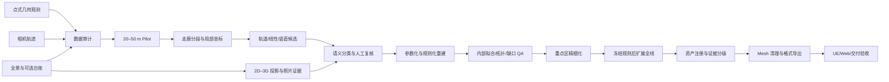

# 铁路场景证据分级三维重建技术手册

版本：工具包 `v0.1.x`  
适用对象：项目负责人、点云算法工程师、三维建模工程师、前端工程师、质量复核人员

## 1. 手册目的

本手册用于把一套铁路场景三维重建经验复制到新项目。目标不是“一键把点变成漂亮模型”，而是建立一条可追踪、可复核、可回退的生产线：

1. 审计点云、相机轨迹和全景影像；
2. 先用 20–50 m 小样段验证坐标、投影、阈值和构件规则；
3. 在站场或其他重点区进行精细建模；
4. 再将已冻结的规则扩展到全线；
5. 为每个资产记录证据来源、置信度和人工结论；
6. 通过几何、Mesh、UE/Web 和交付安全验收。

工具包负责可复用的项目初始化、数据审计、走廊分段、资产注册、运行清单、基础 QA 和上传前安全检查。具体资产重建算法必须按项目数据情况启用；没有证据的构件不得被自动包装成“实测成果”。

## 2. 适用范围与非目标

### 2.1 适用输入

- LAS/LAZ 点式几何观测；
- 由高斯场景导出的点式观测；
- 相机轨迹 CSV；
- 与轨迹关联的现场全景图；
- 可选的 CRS、垂直基准、控制点、设计图、设备台账或人工复测结果。

### 2.2 适用输出

- 分段点云和派生候选；
- 轨道、接触网、站台、雨棚、站房可见立面及附属资产的结构化模型；
- 资产注册表与资产关系；
- GLB、FBX、OBJ 等交付格式；
- 点—模型拟合、缺口、Mesh、UE 和 Web 验收报告；
- 每次运行的配置快照、输入哈希、软件版本和限制声明。

### 2.3 明确非目标

- 不把缺失背面自动解释成高可信实测模型；
- 不因输入来自高斯表示，就宣称使用了原始高斯 covariance、scale、opacity 或 visibility；
- 不在缺少坐标基准时宣称绝对测量精度；
- 不以“网页能显示”替代现实几何正确性验收；
- 不以 Mesh 无破面替代资产存在性、类型和拓扑正确性验收。

## 3. 总体技术路线



## 4. 角色与责任边界

| 角色 | 主要责任 | 不得独立决定的事项 |
|---|---|---|
| 项目负责人 | 冻结范围、版本、验收指标和发布权限 | 不得跳过数据安全与人工复核门禁 |
| 数据工程师 | 输入盘点、字段校验、坐标说明、分段和哈希 | 不得猜测 CRS 或垂直基准 |
| 算法/建模工程师 | 候选提取、拟合、参数化重建和缺口闭环 | 不得将推断资产标为观测资产 |
| 铁路专业复核人 | 资产类型、连接关系、专业归属和规则冲突判定 | 不得在无证据时补写精确尺寸 |
| QA 人员 | 独立检查几何、Mesh、注册表和交付格式 | 不得只检查同一默认镜头 |
| Web/UE 工程师 | 导入、显示、拾取、性能和材质验收 | 不得修改几何后不回写版本和注册表 |

任何影响资产存在性、专业类别或实测/推断边界的结论，都必须由人工确认。自动流程可以排序候选和建议结论，但不能静默替代复核。

## 5. 证据等级

所有资产必须且只能选择一个主证据等级：

| 等级 | 定义 | 允许用途 | 页面表现建议 |
|---|---|---|---|
| `observed` | 点式几何对关键形体有直接、连续支持 | 内部拟合统计、结构化建模 | 正常材质 |
| `photo_interpreted` | 点支持不足，但可在已配准照片中确认存在与可见轮廓 | 可见立面、门窗、标识等解释性建模 | 单独图例或信息标签 |
| `rule_inferred` | 依据铁路规则、邻接关系或重复规律补全 | 展示和候选分析；不得冒充实测 | 低置信颜色或默认可关闭 |
| `unsupported` | 当前证据无法确认，或仅为占位体块 | 空间占位、待补采清单 | 明显区分并默认提示限制 |

`confidence` 是当前证据下的判断置信度，不等于厘米级精度，也不等于资产正确概率已被统计校准。未经独立真值校准，不得把它称为“准确率”。

详见 [资产注册表与证据等级](ASSET_REGISTRY_CN.md)。

## 6. 三阶段生产策略

### 6.1 阶段 A：20–50 m Pilot

目的：用最小成本暴露全局问题。Pilot 应包含至少两类关键资产，并尽量覆盖遮挡、站台边缘或接触网等难点。

Pilot 需要完成：

- 输入审计通过；
- 相机轨迹方向、单位和旋转约定确认；
- 点云与照片能够在多个视角合理对应；
- 钢轨中心、轨距、轨顶高程等基础几何完成首轮拟合；
- 竖直构件能够区分接触网支柱、雨棚柱、建筑边缘和误检；
- 资产 ID、证据等级和人工复核流程跑通；
- 至少一次 Mesh 导出和 Web/Blender 查看。

Pilot 未通过时不得直接跑全线。调整阈值后必须保留新的配置快照和复核记录。

### 6.2 阶段 B：重点区精细化

重点区通常为站场、道岔、密集接触网、站台—雨棚—楼梯交界或站房可见立面。此阶段重点解决：

- 站台分段高程、边界、端部和开口；
- 雨棚真实屋面段、柱网、柱帽、横纵梁和排水；
- 楼梯、电梯、栏板及交界；
- 轨道段界、钢轨与轨枕/道床贴合；
- 接触网支柱方向、腕臂、定位器、绝缘子及线索连续性；
- 照片解释立面和不可见背面分级；
- 缺口网格逐格定性。

重点区通过后冻结通用规则。站点特例必须留在项目配置中，不能写入通用算法。

### 6.3 阶段 C：全线扩展

全线扩展采用固定长度走廊分段，并保留重叠或接缝检查区。执行顺序是：

1. 自动生成分段计划；
2. 人工检查每段边界；
3. 分段提取与并行处理；
4. 每段生成资产和质量报告；
5. 对段界做轨道、线索、站台及地形连续性检查；
6. 合并资产注册表；
7. 执行全线缺口、重复和冲突审计；
8. 形成 clean 主模型与可选 evidence/candidate 图层。

## 7. 标准操作流程

### 7.1 项目初始化

```powershell
railway-recon init projects/sample --name "Sample Railway"
railway-recon validate --project projects/sample/project.json
```

生产输入放入项目的 `input/`，该目录默认不进入 Git。修改 `project.json` 和 `rules.json` 前先保留原模板。

### 7.2 输入审计

```powershell
railway-recon audit --project projects/sample/project.json
```

正式发布或冻结基线时增加完整点云哈希：

```powershell
railway-recon audit --project projects/sample/project.json --full-hash
```

必须查看 `workspace/reports/input_audit.json`，不要只看命令退出码。重点检查：

- LAS/LAZ 点数、范围、scale/offset 和字段；
- RGB、intensity、GPS time 是否存在；
- 相机索引与时间是否严格递增；
- 重复照片引用和缺失照片；
- 轨迹总长度与项目认知是否一致；
- CRS、垂直基准和控制点是否真实可用。

### 7.3 分段规划与 Pilot 提取

```powershell
railway-recon plan-segments --project projects/sample/project.json
```

先人工检查 `workspace/manifests/segments.generated.json`。自动边界是围绕相机轨迹生成的保守轴对齐包围盒，不等于铁路限界。确认无误后只裁切 Pilot 段：

```powershell
railway-recon segment --project projects/sample/project.json --ids <segment-id>
```

不要在未检查边界时使用覆盖写入。确需重跑时，先归档旧运行清单，再使用 `--overwrite`。

### 7.4 候选、语义与重建

重建模块按以下顺序工作：

1. 轨道低高程带提取与纵向连续拟合；
2. 竖直和高空线性候选提取；
3. 点候选向照片投影，构建证据截图或逻辑引用；
4. 按几何、位置、照片和铁路规则分类；
5. 人工处理低置信、冲突和误检候选；
6. 生成参数化轨道、支柱/柱网、接触网线索、站台和雨棚；
7. 恢复照片可见立面；
8. 将不可见结构保留为 `rule_inferred` 或 `unsupported`。

代表性相机的姿态约定可先用统一入口搜索：

```powershell
railway-recon calibrate-projection --project projects/sample/project.json --segment <segment-id> --camera-index <camera-index>
```

该命令基于点色与全景像素的一致性对欧拉顺序、内外旋方向和轴映射进行假设排序。最低 RGB 误差不是正确标定的充分条件；必须在多个相机上目视检查结构边缘，并将最终约定写入项目配置与复核记录。

当前仓库若尚未为某一资产提供统一 CLI，必须通过受版本控制的项目脚本调用库函数，禁止把现场坐标复制进核心模块，也禁止直接复制历史 `_vNN` 脚本作为新项目入口。

### 7.5 资产注册与 QA

```powershell
railway-recon registry-init --project projects/sample/project.json
railway-recon registry-check --project projects/sample/project.json
railway-recon qa --project projects/sample/project.json
```

每次几何更新必须同步注册表。GLB、FBX、OBJ 的可查询资产数和 ID 集合应保持一致；候选证据层可以单独导出，但不得与 clean 主模型混淆。

### 7.6 Mesh 和交付

发布前按 [质量验收规范](QA_ACCEPTANCE_CN.md) 执行：

- 退化面、重复面、共面重叠、非有限顶点；
- 法线、绕序、背面、材质透明和 Z-fighting；
- 钢轨段界和轨枕穿插；
- 站台分缝、悬空和开口；
- 柱—柱帽—梁—屋面真实接触；
- 楼梯顶层平台与栏板接口；
- 细线远近显示；
- Web 资产点击、高亮、筛选和移动端性能；
- UE/Blender 单位、轴向、法线、碰撞和 Nanite/LOD 策略。

## 8. 精度声明规则

### 8.1 内部拟合精度

内部拟合描述模型与当前点式观测之间的距离，例如 MAE、RMSE、P50、P90、P95。它能说明“模型贴合输入证据的程度”，不能证明输入本身在真实世界中的绝对准确性。

### 8.2 绝对精度

只有同时确认以下内容，才可讨论绝对测量精度：

- CRS/EPSG；
- 垂直基准；
- 控制点或同等级独立测量真值；
- 坐标转换链和误差传播；
- 明确的抽样方法和独立评价区。

缺少任一关键项时，报告必须写：

> 当前误差为模型相对于输入点式观测的内部拟合误差，不代表绝对测量精度。

## 9. 版本、运行与回退

- 软件使用语义化版本，例如 `v0.1.0`；
- 不再创建 `algorithm_v91.py` 之类文件；
- 项目结果以 `run_id`、Git commit 和配置哈希识别；
- clean 主模型、候选证据层和历史回退模型分开保存；
- 删除或拒绝的资产在注册表中保留状态，不复用其 ID；
- 每个正式交付必须附 manifest、QA 报告和限制清单。

## 10. 新项目完成定义

只有同时满足以下条件，项目才可称为“已交付”：

- 输入与运行可追踪；
- Pilot、重点区和全线三个门禁均通过；
- 所有资产有唯一 ID、状态和证据等级；
- 未处置候选数量为零，或有书面延期结论；
- 内部拟合和绝对精度声明没有混用；
- clean 模型不存在明显破面、悬空、重复或 Z-fighting；
- UE/Blender 和 Web 均完成独立验收；
- 发布包不包含原始现场数据、精确坐标、个人信息、密钥或本机路径；
- 同事依据交接清单可在另一台电脑复现数据审计和样例流程。

新项目逐项执行请使用 [新项目检查清单](NEW_PROJECT_CHECKLIST_CN.md)。
