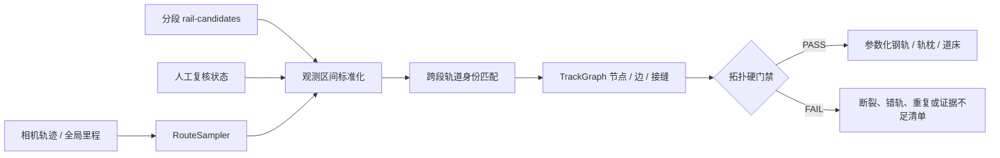

# 全局轨道拓扑 TrackGraph v1

## 1. 为什么先建图、后建 Mesh

历史项目把每个 50 m 区段独立拟合，再按端点距离拼接。这个做法会产生四类难以靠 Mesh 清理补救的问题：

- 每段的 `TRACK-0001` 只是局部编号，可能对应不同股道；
- 局部 PCA 方向可能翻转 180°；
- 缺少观测时，连接器会把真正的断轨伪装成连续轨道；
- 新旧区段同时存在时，会生成重叠轨道、重复轨枕和闪面。

TrackGraph v1 把相机轨迹累计里程定义为唯一主轴。分段只负责提供观测，不再拥有独立的线路方向和全局轨道身份。任何跨段 Mesh 必须来自已通过门禁的 TrackGraph。



## 2. 关键设计

### 2.1 唯一里程方向

- 使用 `camera.csv` 轨迹累计距离作为 canonical chainage；
- 每段候选框架的 `along_xy` 必须与该里程方向同向；
- 坐标框架行列式必须接近 `+1`；
- 方向点积或行列式不合格时直接失败，禁止自动翻转后静默继续。

### 2.2 稳定全局轨道 ID

首段按线路横向位置建立 `TRACK-0001...`。相邻段使用横向位置、轨顶高程、轨距和方向共同匹配。匹配阈值只用于确认“可能是同一股道”，不能作为接缝验收阈值。

若候选无法匹配：

- 创建新的候选轨道身份；
- 报告未确认的线路内部起点/终点；
- 不生成视觉连接器；
- 不把缺口标为 `observed`。

### 2.3 观测与推断分开

每条边必须声明 `evidence_level`：

- `observed`：当前点式几何直接支持；
- `photo_interpreted`：照片可确认但点支持不足；
- `rule_inferred`：按连续性或铁路规则推断。

构建器默认只生成 `observed` 边。推断边必须由后续审批流程显式加入，并受连续长度和总占比限制。未通过的推断不能进入 authoritative/clean 模型。

### 2.4 半开区间所有权

生产分段应使用核心半开区间 `[start, end)`；重叠上下文只用于拟合，不能让两个区段同时生成同一核心里程的正式几何。TrackGraph 保存区段观测范围并检查重复、间隙和内部终止。

实现上还必须进一步限制：上下文点只参与走廊方向估计，轨头占用率、峰值评分、轨道配对、轨顶高度拟合和候选点输出都只能使用核心里程点。候选报告必须同时保存源搜索点数、核心搜索点数、核心局部范围和核心里程范围；缺少这些字段时不能证明没有 core/context 泄漏。

相邻段确认属于同一全局股道后，允许在冻结自动修正上限内进行显式边界共识：两侧端点各移动原始差值的一半并共享同一边界点。TrackGraph 必须保留原始横向、高程、三维差值、每侧修正量与共识坐标。超过上限时不修正并保持失败；这不是长连接器，也不能用来掩盖 0.5 m 断裂。

## 3. 命令

先对每段运行轨道候选提取和人工复核，在报告中写入：

```json
{
  "review_status": "accepted"
}
```

再构建全局 TrackGraph：

```powershell
railway-recon track-graph-build `
  --project projects/sample/project.json `
  --source s0000_0050m=projects/sample/workspace/reports/s0000_0050m_rail_candidates.json `
  --source s0050_0100m=projects/sample/workspace/reports/s0050_0100m_rail_candidates.json
```

输出：

```text
workspace/derived/track_graph.json
workspace/reports/track_graph_audit.json
```

独立复验或修改后复验：

```powershell
railway-recon track-graph-validate `
  --project projects/sample/project.json `
  --graph projects/sample/workspace/derived/track_graph.json
```

`fail` 和 `review_required` 均返回非零退出码，不能在 CI 中被当作成功。正式 Gate 将审计报告作为不可豁免的轨道拓扑检查：

```powershell
railway-recon gate-evaluate `
  --project projects/sample/project.json `
  --release-id release-001 `
  --gate-id QG5 `
  --check track.graph=projects/sample/workspace/reports/track_graph_audit.json
```

## 4. 当前项目默认门禁

以下数值是本工具包的保守项目默认值，不是铁路行业验收规范。新项目应通过 Pilot、测量要求和专业复核校准，随后冻结配置哈希。

| 检查 | 默认值 |
|---|---:|
| 分段方向点积 | ≥ 0.99 |
| 坐标框架行列式误差 | ≤ 0.001 |
| 单点轨距误差 | ≤ 20 mm |
| 轨道观测 bin 覆盖 | ≥ 80% |
| 轨道区间观测覆盖 | ≥ 80% |
| 未观测连续长度 | ≤ 5 m |
| 推断连续长度 | ≤ 5 m |
| 推断权威区间占比 | ≤ 10% |
| 接缝里程间隙 | ≤ 20 mm |
| 接缝横向误差 | ≤ 15 mm |
| 接缝高程误差 | ≤ 20 mm |
| 接缝三维误差 | ≤ 30 mm |
| 接缝切向夹角 | 约 ≤ 0.1° |
| 自动修正量 | ≤ 50 mm |
| 重复轨道中心距离 | < 250 mm 且重叠 > 2 m |

身份匹配允许的搜索范围比接缝验收阈值宽。搜索范围宽不代表几何合格；匹配后仍必须单独通过接缝门禁。

## 5. 自动阻断问题

TrackGraph v1 会阻断：

- 线路或局部段 180° 反向；
- 镜像坐标框架；
- 跨段匹配到错误股道；
- 区段边界断缝或大幅高程跳变；
- 通过长连接器掩盖缺测；
- 线路内部无道岔/终止证据的轨道出生或消失；
- 轨道中心线重复；
- 轨距超限；
- 纵向点支持不足；
- 未人工复核的候选被标成可发布结果；
- 图节点、边、接缝或引用关系损坏。

## 6. 历史失败回归

合成回归固定覆盖：

1. 两段直线同一股道获得同一全局 ID；
2. 第二段反向时不允许强接；
3. 横向跳到另一股道时产生显式断裂；
4. 0.5 m 接缝必定失败；
5. 0.1 m 小接缝在冻结的单侧修正上限内可显式共识，并保留原始差值和修正记录；
6. 中心相距 0.2 m 的重叠轨道必定失败；
7. 超过 5 m 的推断边不能成为权威轨道；
8. 未复核候选最多只能得到 `review_required`。

这些测试对应本项目曾出现的断轨、双轨压叠、错误轨族、长距离推断和整线反向问题。以后发现新的 major/critical 轨道错误，必须先加入回归，再修生成器。

## 7. 当前边界与下一步

TrackGraph v1 通过后，可以生成连续的候选轨道 Mesh：

```powershell
railway-recon build-track-graph-mesh `
  --project projects/sample/project.json
```

生成器会再次核对 TrackGraph、审计报告、相机 CSV 哈希和参数哈希，然后输出：

```text
workspace/exports/track_graph/track/track_graph_track.obj
workspace/exports/track_graph/track/railway_model.mtl
workspace/exports/track_graph/track/model_origin.json
workspace/reports/track_graph_mesh_build.json
workspace/reports/track_graph_mesh_audit.json
```

每股道只生成四个可见资产节点：左轨、右轨、全局相位轨枕组和道床。轨枕不再从每段起点重新计数，也不再产生大量未登记的独立 Mesh 节点。所有节点均写入资产注册表，并通过 `contains` 关系连接到全局轨道资产。

生成资产仍是 `candidate`：自动拓扑和 OBJ 检查通过，不等于固定视角、点—模型拟合和铁路专业复核通过。人工验收完成前不得冻结为 release。

当前仍需继续实现：

- 从真实轨头点拟合随里程变化的轨顶高程和超高，而不是段内常高；
- 对道岔建立有专业证据的度 3 节点；
- 为每条轨道生成独立留出点残差和六个固定视角；
- 把历史 200 m 失败区间整理为受控回归证据，避免真实坐标和客户数据进入公开仓库。

旧的逐段 `build-track` 仍只能作为 Pilot 候选输出，不能代替全局 TrackGraph，也不能直接作为全线 clean 模型。

## 8. 轨头提纯、尺度定义与独立复核

轨头候选不再使用“横向占用率最高即钢轨”的规则。默认流程先在每个纵向格网中取最高点，再计算相对横向邻域地表的高度突起，并按沿程覆盖率寻找轨头。短分段方向使用带上下文的主轴回归，避免车辆横摆把窄轨头峰抹宽。新项目必须在 Pilot 中标定：

- 轨顶高度搜索窗；
- 点云或派生点云采样分辨率；
- 方向上下文前后长度；
- 高度突起和覆盖率阈值；
- 钢轨中心位置最大规则化修正量。

`1.435 m` 是两钢轨工作边之间的轨距，不是钢轨中心距。当前 60 kg/m 近似截面轨头宽度为 `0.073 m`，参数化两钢轨中心距因此为 `1.508 m`。报告同时保存原始峰间距、推定轨距、规则化后中心距和每根钢轨修正量，禁止只保留修正后的结果。

5 cm 派生点云的当前保守默认值为：选中峰支持率不低于 20%，接缝横向/高程误差不超过 75 mm，三维端点差不超过 100 mm。它们是与采样分辨率匹配的项目默认值，不是铁路行业验收限差；使用更高分辨率输入时应在 Pilot 中收紧并冻结配置哈希。

轨道峰配对与轨顶高度拟合是两个不同任务，配置上必须显式分离。推荐的精修变体用
`rail_pair_top_method=height_grid_max` 保持轨道配对拓扑，用
`rail_top_fit_method=anchored_quantile` 对已选中轨头逐沿程格网估计高度。这样修改轨顶
估计器不会无意新增/删除钢轨或改变轨道 ID。新项目应在嵌套训练验证中同时检查候选线
数量、匹配精度、横向、轨距、垂向和点支撑；不得只看垂向残差。
可从 `configs/templates/rail_detection.anchored_vertical.example.json` 复制这一解耦
配置，但高度窗、上下文和阈值仍必须在新项目 Pilot 内重新验证并冻结。

候选生成后先建立独立复核包：

```powershell
railway-recon track-review-create `
  --project projects/sample/project.json `
  --source s0000_0050m=<rail-report.json> `
  --source s0050_0100m=<rail-report.json>
```

复核人在 `rail-candidate-review.csv` 中逐段填写 `accepted/rejected`、姓名、时间和备注，再运行：

```powershell
railway-recon track-review-apply `
  --project projects/sample/project.json `
  --path projects/sample/workspace/reports/track_graph_rail_review_v1
```

命令校验原候选 SHA-256，只生成带复核来源的新报告副本，不修改自动候选。存在空决定、来源漂移、缺少复核人或拒绝项时均阻断。TrackGraph 和连续 Mesh 必须使用这些 reviewed 副本。

若项目负责人明确接受风险、不等待独立签字，可使用显式豁免。它同样锁定来源
SHA-256 且不修改原候选，但会标记为 `project_owner_override`，因此不能宣称完成了
独立复核：

```powershell
railway-recon track-review-owner-override `
  --project projects/sample/project.json `
  --path projects/sample/workspace/reports/track_graph_rail_review_v1 `
  --approved-by project-owner `
  --reason "Project owner approved generation without independent signature"
```

连续中心线直接使用分段钢轨拟合线的世界坐标控制点，不再把相机轨迹法向量当作钢轨
中心线。生成前还会检查相邻采样步长、方向折角和回折；这三项可阻断相机轨迹起终点
抖动被横向放大后产生的交叉面、折轨和扭曲轨枕。

## 9. 道岔与收敛股道的特殊处理

标准轨距配对器适用于普通线路，不适合直接决定道岔拓扑。进入道岔后，两条股道中心会逐步靠近，完整的两峰标准轨距配对可能暂时消失，尖轨、护轨和共用钢轨也会产生额外峰值。此时如果继续使用普通区间的最小股道中心距互斥规则，常见错误是把真实的汇入股道截成平头断轨。

全线处理必须按以下顺序执行：

1. 普通区间仍使用标准轨距配对和全局 TrackGraph；
2. 对内部轨道终止点渲染无模型覆盖的原始点云平面条带和横断面；
3. 检查终止点后是否仍存在连续、逐步收敛的轨形线性证据，以及现场是否存在止挡器；
4. 证据不足时保留 `topology_unresolved`，不得静默补线；
5. 仅当项目负责人明确接受展示风险时，才允许配置低置信度道岔连接器；
6. 连接器必须是独立橙色 Mesh、独立 `rule_inferred` 资产，并记录分支股道、目标股道、起止里程、原因和限制；
7. 没有尖轨、辙叉、护轨和道岔轨枕证据时，不得把连接器称为完整道岔模型。

`global_mesh.turnout_connectors` 默认关闭。启用时还必须显式设置 `allow_rule_inferred_turnout_connectors=true`、最大推断长度和不高于默认推断置信度的 `confidence`。构建器只接受末端已标记为 `confirmed_turnout` 的分支股道，并继续执行中心线重复点、回折、Mesh 和资产映射检查。

模型构建会同时输出 `track_graph_mesh_assets.json`。即使使用 `--skip-registry`，该 sidecar 仍完整记录本次生成的可见对象、推断区间和道岔连接器，便于后续 Web/UE 集成前复核。
