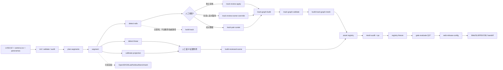

# 00｜系统执行图

## 先说结论

当前代码没有 `Pipeline` 类、stage registry 或“一键 raw-to-release”编排器。真正入口是 `pyproject.toml` 中的 `railway-recon = railway_recon.cli:main`；`src/railway_recon/__main__.py` 也转入同一个 `main()`。`src/railway_recon/cli.py::build_parser()` 注册子命令，`main()` 顺序分派，`_project_command()` 负责加载项目、写运行清单和把不满足 `required_status` 的结果变成退出码 5。

因此，“完整流程”是操作者按依赖顺序调用多个显式命令，而不是代码自动推导依赖。遗漏一步不会总是在下一步之前被统一编排器捕获；保护来自每个阶段自己的输入验证、哈希绑定和 fail-closed gate。

## Execution flow

## 真正的 entrypoints

| 入口 | 路径/符号 | 调用方 | 调用内容 | Side effect | 常见失败 |
|---|---|---|---|---|---|
| Python CLI | `src/railway_recon/cli.py::main` | `railway-recon` / `python -m railway_recon` | 所有生产、QA、实验命令 | 取决于子命令；通常还写 run manifest | 参数错误、项目验证失败、退出码 2/5 |
| 项目命令包装 | `cli.py::_project_command` | `main()` | `load_project()`、action、`write_run_manifest()` | `runs/<timestamp>/...` | 异常时写 failed manifest 后重抛；状态不满足返回 5 |
| 项目初始化 | `config.py::initialize_project` | `init` | 写模板、默认规则与配置 | 创建完整新项目目录 | 目标非空、ID 非法、路径错误 |
| Web | `web/src/main.js::load` | Vite 页面 | 加载项目配置、模型、注册表并校验验收模式 | 浏览器内场景和交互状态 | 验收绑定缺失时 `failClosed()` |
| Blender/DCC | `blender/*.py` | Blender 命令行/人工 | 集成、检查、修复和导出场景 | 修改 DCC 场景/导出物 | 依赖 Blender API；不属于安装包自动流水线 |
| 测试 | `pytest` | 开发者/CI | `tests/` 下 113 个收集测试（本次静态收集结果） | 临时目录 | 可选 Open3D 测试需要额外依赖 |

## 阶段清单

| 阶段 | 实际 producer | 输入 | 输出 | consumer | 失败行为 | 分类 |
|---|---|---|---|---|---|---|
| Bootstrap | `initialize_project()` | project id/name | `project.json`、配置、目录 | 全部项目命令 | 拒绝覆盖非空目录 | 强制一次 |
| Validate | `validate_project_value()` | `project.json` | 错误列表/成功 | `load_project()` | 非法 schema 立即异常 | 每次命令隐式强制 |
| Input audit | `audit.audit_project()` | 点云、相机、照片引用 | `reports/input_audit.json` | run manifest、人工判断 | 文件/列/引用错误；绝对精度限制写入报告 | 正式项目强制，但代码未作为所有下游硬前置 |
| Segment plan | `segments.plan_segments()` | camera trajectory、分段配置 | segment manifest | `crop_segments()`、frame fitting | 自适应区重叠/长度非法失败 | 检测前强制 |
| Crop | `segments.crop_segments()` | LAZ/LAS、manifest | 每段 LAZ + crop report | detectors | 拒绝覆盖、临时 partial 后原子替换 | 检测前强制 |
| Rail perception | `detect_rail_candidates()` | segment LAZ、rail config、相机 | candidate LAZ、PNG、JSON | review/curation | 空候选或参数错误失败；输出状态仍非权威 | 轨道流程强制 |
| Linear perception | `detect_linear_candidates()` | segment LAZ、linear config | vertical/cable LAZ、JSON | 人工分类/布局 | 仅生成未分类候选 | 站场资产可选辅助 |
| Projection hypothesis | `projection.calibrate_projection()` | 彩色点云、pose、全景 | overlay + calibration report | 人工照片解释 | 无 RGB/旋转/候选点失败；必须视觉验收 | 照片资产可选但推荐 |
| Rail acceptance | `rail_review.*` / `rail_pair_curation.curate_rail_pairs()` | 候选报告、诊断、决策 | 哈希绑定的 accepted reports | TrackGraph | 缺 reviewer/原因/哈希变化即 block | TrackGraph `pass` 前强制 |
| Graph/state | `track_graph.build_track_graph()` | 已接受的分段报告、camera、config | graph + audit | mesh builder | 不 force-connect；审计给 fail/review_required | 权威轨道强制 |
| Track mesh | `build_track_graph_mesh()` | graph、通过审计、配置 | OBJ/MTL、origin、audit、assets | registry/Blender/export | 哈希、配置、接触、网格任一失败即异常 | 权威轨道强制 |
| Reviewed scene | `build_reviewed_scene()` | 人工审核布局 JSON | OBJ/MTL、registry records | DCC/export | 证据/几何/重复 ID 非法即失败 | 非轨道资产当前主路径 |
| QA | `quality_report()`、`audit_obj()`、关系审计脚本 | 报告、模型、registry | QA JSON | gate/人 | `release_ready=false` 或具体失败 | 发布前强制 |
| Freeze | `freeze_release_registry()` | 工作注册表 | frozen registry | gate/web config | 任一非 accepted/空 registry 拒绝 | 发布强制 |
| Gate | `evaluate_quality_gate()` | reports、artifacts、registry、approvals | 不可变 gate 目录 | 下一 gate/发布 | 显式非 pass 均阻断；退出 5 | 发布强制 |
| Export/handoff | Blender scripts + `build_web_acceptance_config()` | 模型、frozen registry | GLB/FBX/OBJ、Web config | Web/UE/同事 | 哈希/资产集合不匹配拒绝 | 交付强制 |

## Mandatory、default-off 与 experimental

- **代码上强制**：项目 schema；项目内输出路径；TrackGraph mesh 前的 graph hash/audit/config/camera binding；发布 registry 全 accepted；QG7–QG9 有哈希 artifact；Web acceptance 绑定。
- **流程上应该强制、但没有总编排器统一强制**：输入审计、全部中间 QA、按 QG0→QG9 顺序传 `previous_gate`。操作者若完全绕开命令直接写文件，系统无法神奇阻止。
- **默认关闭/诊断**：`track-graph.default.json` 中 paired continuity gate 默认 disabled/diagnostic-only；推断边网格通常由 `track-build.default.json::global_mesh.require_observed_edges` 拒绝；独立检查点默认缺失。
- **可选/实验**：Open3D baseline、GISLab 归一化、point holdout、bootstrap、defect injection、topology ablation、vertical follow-up。它们位于 benchmark 命令，不是生产 source of truth。
- **旧基线**：`algorithms/track.py::build_parametric_track()` 直接消费候选报告，生成直线参数化轨道。它没有执行当前严格人工复核契约；只适合 baseline/演示，不能作为推荐权威入口。

## 报告与代码的已确认差异

1. 项目叙述常称存在 `RailAssetGraph`；当前代码没有同名 class/schema。实际实现是 `asset-registry.schema.json` 的 `assets + relations`。
2. 项目叙述常像“一键 pipeline”；当前代码是显式 CLI 阶段集合，无总 DAG 编排器。
3. 项目叙述中的自动站台/雨棚/接触网/立面重建，当前公开代码只能确认候选提取和审核布局建模，完整自动拟合为 **UNKNOWN/未实现**。
4. `project.schema.json` 的 `algorithms.required` 未要求 `track_graph`，但模板包含它，TrackGraph 代码也可回退内置默认。若依赖 schema 判断“必有 TrackGraph 配置”会得出错误结论。

